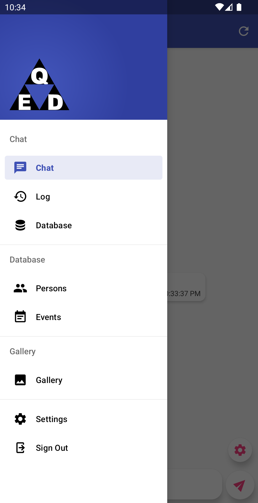
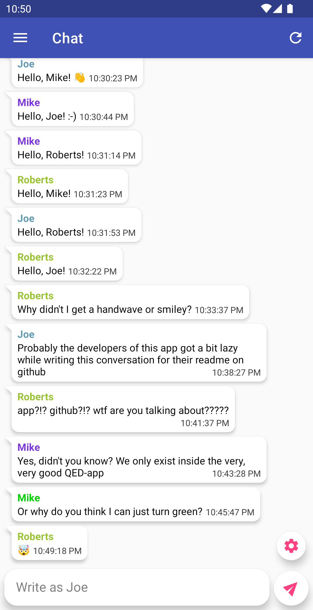
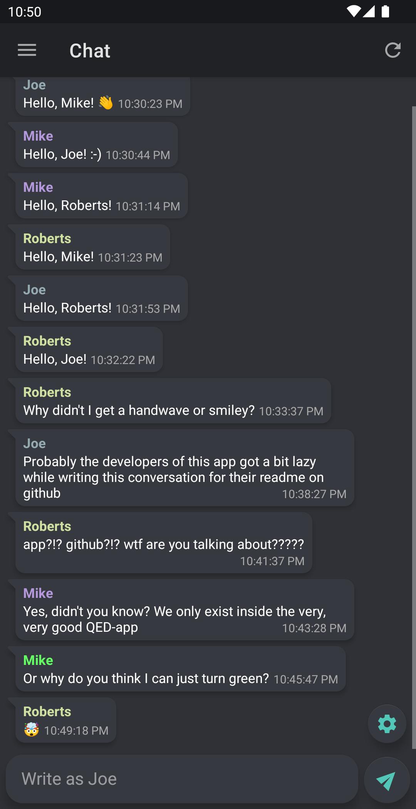
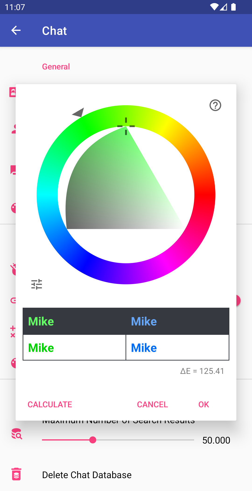
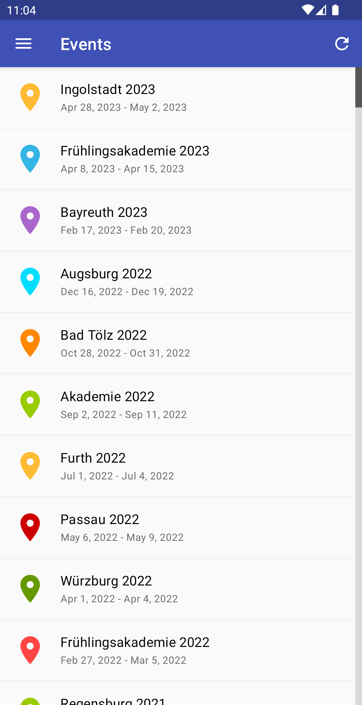
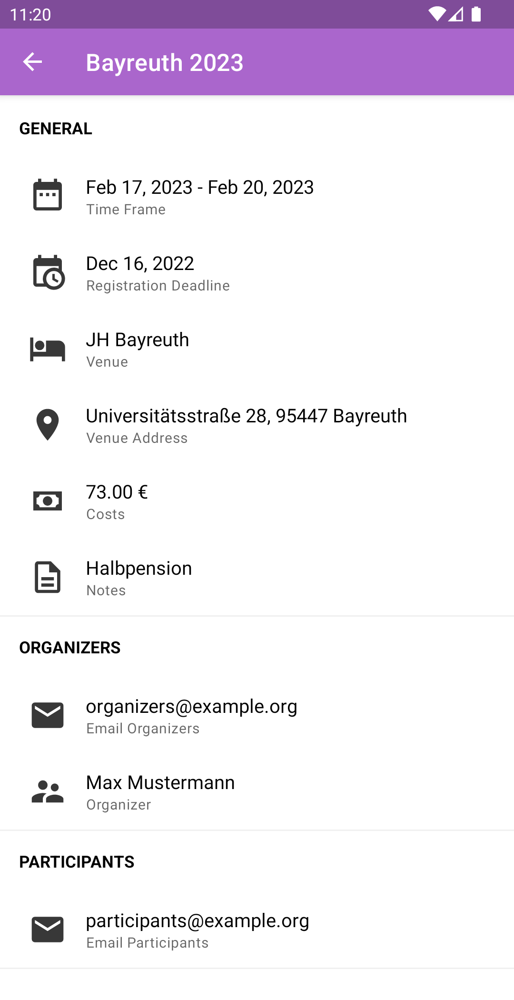
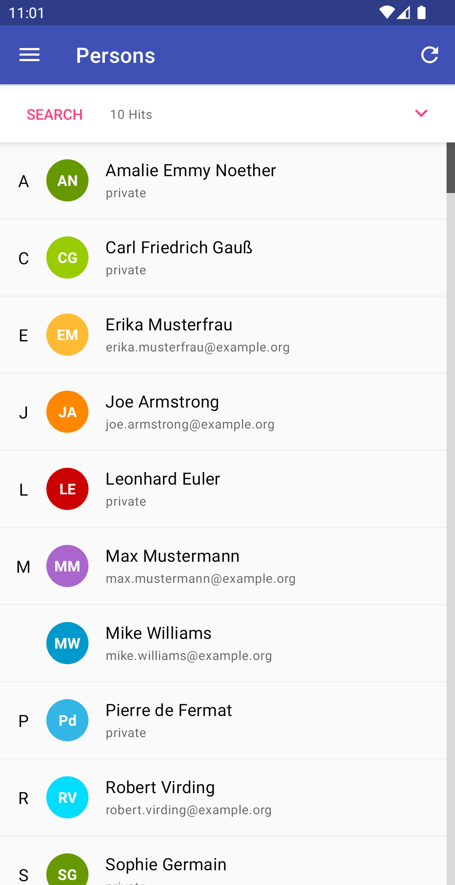
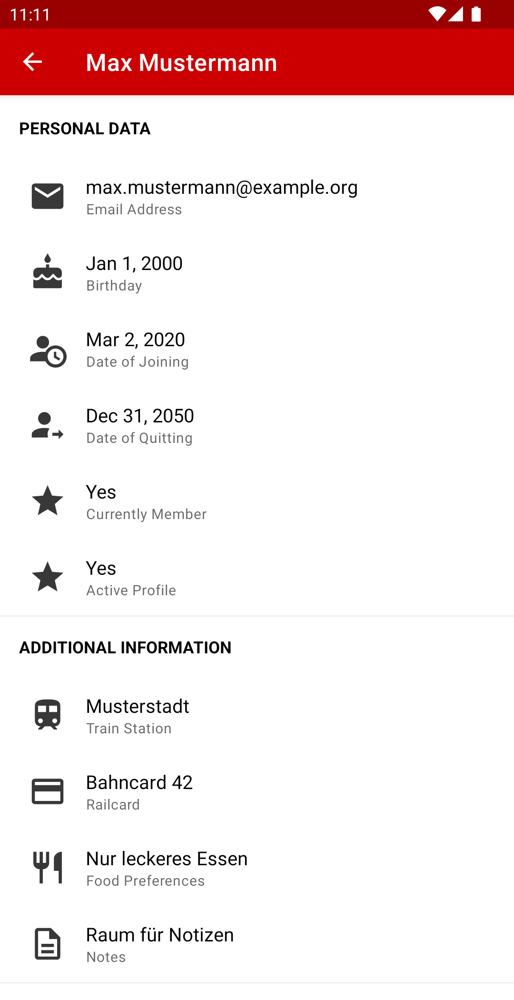

# The very, very good QED-App [^1]
_Disclaimer: This app is not related to the [Quod Erat Demonstrandum e.V.](https://qed-verein.de) in any official way._

## Installation
You can find the most recent release and pre-release APKs under the [Releases](https://github.com/jbb01/qed/releases) tab.

A [port for iOS](https://www.youtube.com/watch?v=dQw4w9WgXcQ) will be available very soon™!

## Overview
The app bundles the [chat](https://chat.qed-verein.de), [gallery](https://gallery.qed-verein.de) and
[database](https://qeddb.qed-verein.de) into one very, very good app.

 

[^1]: It is very, very good indeed!
